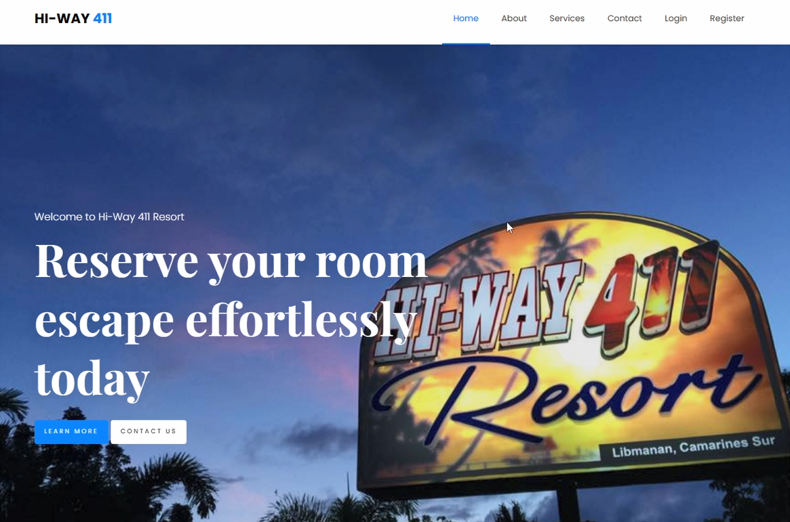
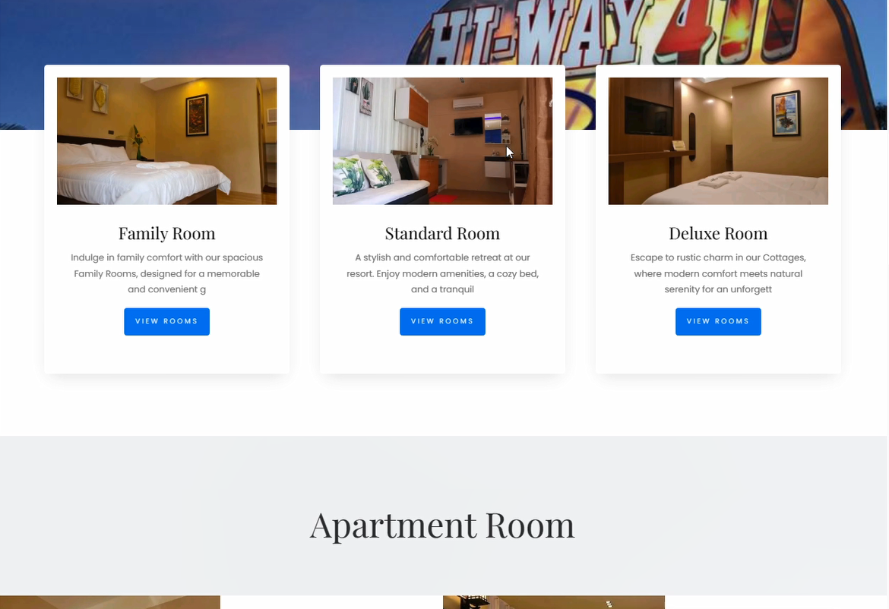

# Resort Reservation System

**A professional resort reservation system built with PHP and MySQL, featuring a user-friendly booking interface and a robust admin panel for resort management.**

---

## 🚀 Quick Start

1. **Install dependencies**
   ```bash
   composer install
   ```
2. **Copy environment file**
   ```bash
   cp .env.example .env
   ```
3. **Set up your database**
   - Create a MySQL database named `highway411`
   - Import `database/highway411.sql` via phpMyAdmin
4. **Run the application**
   - Point your web server to the `public/` directory
   - Access via `http://localhost/hi-way-411`

---



## ✨ Key Features

- **User Features**

  - Online room booking system
  - Real-time availability checking
  - User account management
  - Booking history tracking

- **Admin Panel**
  - Comprehensive dashboard
  - Room and accommodation management
  - Booking management
  - User management
  - Admin access control

## 🛠️ Tech Stack

- **Frontend:**

  - HTML5, CSS3, JavaScript
  - Bootstrap 4
  - jQuery
  - Custom responsive design

- **Backend:**

  - PHP 8.0
  - MySQL/MariaDB
  - PDO for database operations

- **Additional Technologies:**
  - PayPal Payment Integration
  - Session-based Authentication
  - Responsive Image Handling

## 🚀 Installation

_See Quick Start above for setup instructions._

## 📸 Screenshots

### Landing Page & Booking


_Professional landing page with availability search and booking interface_

### Room Management


_Interactive room listings with detailed information and real-time availability_

### Booking Management


_Streamlined booking management system with status tracking_

## 🔐 Security Features

- Password hashing using PHP's password_hash()
- PDO prepared statements for SQL injection prevention
- Session-based authentication
- Input validation and sanitization
- CSRF protection

## 📄 License

This project is licensed under the MIT License - see the [LICENSE](LICENSE) file for details.

---

## 👤 Author

Dan Martin Magno

- LinkedIn: [https://www.linkedin.com/in/danmartinmagno]
- GitHub: [https://github.com/DanMartinMagno]
