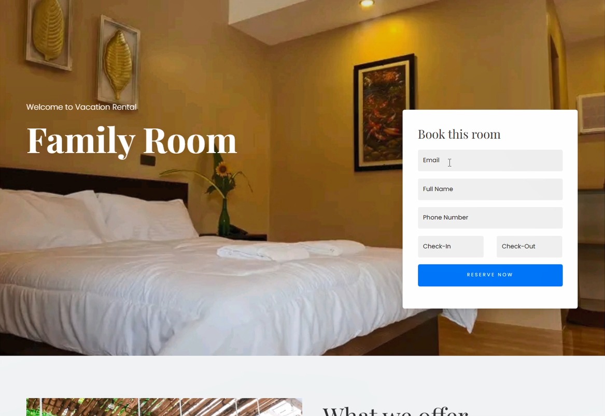

# Hi-Way 411 Resort Reservation System 🏨

**A professional resort reservation system built with PHP and MySQL, featuring a user-friendly booking interface and a robust admin panel for resort management.**

---

## 🚀 Quick Start

1. **Clone the repository**
   ```bash
   git clone https://github.com/yourusername/hi-way-411.git
   ```
2. **Install dependencies**
   ```bash
   composer install
   ```
3. **Copy environment file**
   ```bash
   cp .env.example .env
   ```
4. **Set up your database**
   - Create a MySQL database named `highway411`
   - Import `database/highway411.sql` via phpMyAdmin
5. **Run the application**
   - Point your web server to the `public/` directory
   - Access via `http://localhost/hi-way-411`

---


## ✨ Key Features

- **User Features**

  - Online room booking system
  - Real-time availability checking
  - Secure payment integration
  - User account management
  - Booking history tracking

- **Admin Panel**
  - Comprehensive dashboard
  - Room and accommodation management
  - Booking management
  - User management
  - Admin access control

## 🛠️ Tech Stack

- **Frontend:**

  - HTML5, CSS3, JavaScript
  - Bootstrap 4
  - jQuery
  - Custom responsive design

- **Backend:**

  - PHP 8.0
  - MySQL/MariaDB
  - PDO for database operations

- **Additional Technologies:**
  - PayPal Payment Integration
  - Session-based Authentication
  - Responsive Image Handling

## 🚀 Installation

_See Quick Start above for setup instructions._

## 📸 Screenshots

### Landing Page & Booking


_Professional landing page with availability search and booking interface_

### Room Management


_Interactive room listings with detailed information and real-time availability_

### Admin Dashboard


_Comprehensive admin panel for managing bookings, rooms, and users_

### Booking Management


_Streamlined booking management system with status tracking_

## 🔐 Security Features

- Password hashing using PHP's password_hash()
- PDO prepared statements for SQL injection prevention
- Session-based authentication
- Input validation and sanitization
- CSRF protection

## 🛣️ Future Improvements

1. **Enhanced Features**

   - Email notification system
   - SMS notifications for bookings
   - Advanced room filtering
   - Seasonal pricing
   - Multiple language support

2. **Technical Improvements**
   - API development for mobile applications
   - Implementation of unit tests
   - Docker containerization
   - Enhanced security measures
   - Performance optimization

## 📄 License

This project is licensed under the MIT License - see the [LICENSE](LICENSE) file for details.

---

## 🤝 Contributing

Contributions are welcome! Please fork the repository and submit a pull request. For major changes, open an issue first to discuss what you would like to change.

## 📢 Portfolio Description

**Hi-Way 411 Resort Reservation System** is a full-stack web application built with PHP and MySQL. It features a complete booking management system with secure user authentication, real-time availability checking, and an intuitive admin panel. This project demonstrates proficiency in:

- Full-stack web development
- Database design and management
- Secure user authentication
- Payment gateway integration
- Responsive UI/UX design
- Admin panel development

---

## 🛡️ Professional Standards

- No sensitive credentials or API keys are present in the repository
- All environment variables are managed via `.env` and `.env.example`
- Follows MVC architecture and best practices
- Includes input validation, CSRF protection, and rate limiting

---

_Ready to showcase on GitHub and impress recruiters!_

## 👤 Author

[Your Name]

- Portfolio: [your-portfolio-url]
- LinkedIn: [your-linkedin]
- GitHub: [your-github]

## 🙏 Acknowledgments

- Bootstrap Team for the frontend framework
- PayPal for payment integration
- All contributors and testers

---

_This project was developed as part of a web development portfolio to demonstrate full-stack development capabilities._
